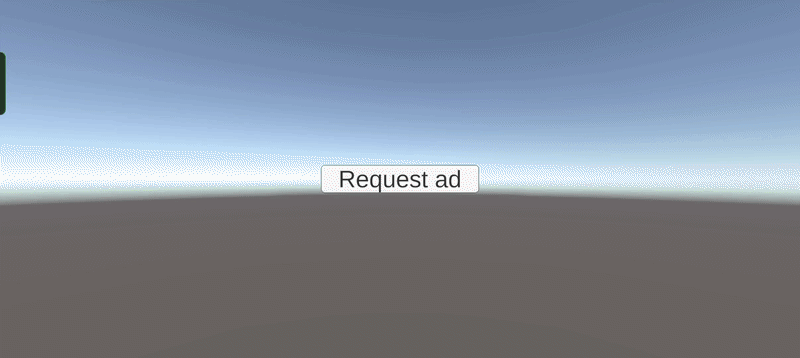

# IMA SDK – Unity Android Integration

A pre-configured `.aar` bundle and Gradle setup for integrating **Google IMA SDK** into Unity Android builds.

---

<p align="center">
  
</p>

## 📦 Installation

### Step 1 – Download the `.aar`

Go to the [Releases](../../releases) section of this repository and download the latest `.aar` file.

### Step 2 – Place the `.aar` in your Unity project

```
Assets/Plugins/Android/
```

---

## ⚙️ Gradle Configuration

Two Gradle template files need to be updated. In Unity, you can find these under:

**Edit → Project Settings → Player → Publishing Settings → Custom Gradle Template**

---

### `mainTemplate.gradle`

Make the following 4 changes:

**1. Add `allprojects` block above the `dependencies` section**

**2. Add IMA SDK and related dependencies inside `dependencies {}`**

**3. Add `coreLibraryDesugaringEnabled true` inside `compileOptions {}`**

**4. Add the `configurations.all` force-resolution block at the end of the file**

<details>
<summary>📄 View complete <code>mainTemplate.gradle</code> sample</summary>

```groovy
apply plugin: 'com.android.library'
apply from: '../shared/keepUnitySymbols.gradle'
apply from: '../shared/common.gradle'
**APPLY_PLUGINS**


allprojects {
    configurations.all {
        resolutionStrategy.eachDependency { DependencyResolveDetails details ->
            if (details.requested.group == 'org.jetbrains.kotlin' &&
               (details.requested.name == 'kotlin-stdlib-jdk7' || details.requested.name == 'kotlin-stdlib-jdk8')) {
                details.useTarget "org.jetbrains.kotlin:kotlin-stdlib:1.8.10"
            }
        }
    }
}

dependencies {
    implementation fileTree(dir: 'libs', include: ['*.jar'])

    implementation ("com.google.ads.interactivemedia.v3:interactivemedia:3.39.0") {
        exclude group: 'org.jetbrains.kotlin', module: 'kotlin-stdlib-jdk8'
        exclude group: 'org.jetbrains.kotlin', module: 'kotlin-stdlib-jdk7'
    }
    implementation 'com.google.android.gms:play-services-ads-identifier:18.0.1'
    coreLibraryDesugaring 'com.android.tools:desugar_jdk_libs:2.1.3'
    implementation "org.jetbrains.kotlin:kotlin-stdlib:1.8.10"
**DEPS**}


android {
    namespace "com.unity3d.player"
    ndkPath "**NDKPATH**"
    ndkVersion "**NDKVERSION**"

    compileSdk **APIVERSION**
    buildToolsVersion = "**BUILDTOOLS**"

    compileOptions {
        sourceCompatibility JavaVersion.VERSION_17
        targetCompatibility JavaVersion.VERSION_17
        coreLibraryDesugaringEnabled true
    }

    defaultConfig {
        minSdk **MINSDK**
        targetSdk **TARGETSDK**
        ndk {
            abiFilters **ABIFILTERS**
            debugSymbolLevel **DEBUGSYMBOLLEVEL**
        }
        versionCode **VERSIONCODE**
        versionName '**VERSIONNAME**'
        consumerProguardFiles 'proguard-unity.txt'**USER_PROGUARD**
**DEFAULT_CONFIG_SETUP**
    }

    lint {
        abortOnError false
    }

    androidResources {
        noCompress = **BUILTIN_NOCOMPRESS** + unityStreamingAssets.tokenize(', ')
        ignoreAssetsPattern = "!.svn:!.git:!.ds_store:!*.scc:!CVS:!thumbs.db:!picasa.ini:!*~"
    }**PACKAGING**
}
**IL_CPP_BUILD_SETUP**
**SOURCE_BUILD_SETUP**
**EXTERNAL_SOURCES**


configurations.all {
    resolutionStrategy {
        // Forces all transitive dependencies to use a unified Kotlin stdlib version
        force "org.jetbrains.kotlin:kotlin-stdlib:1.8.10"
        force "org.jetbrains.kotlin:kotlin-stdlib-jdk7:1.8.10"
        force "org.jetbrains.kotlin:kotlin-stdlib-jdk8:1.8.10"
    }
}
```

</details>

---

### `launcherTemplate.gradle`

Make the following 2 changes:

**1. Add `coreLibraryDesugaring` to the `dependencies {}` block**

**2. Add `coreLibraryDesugaringEnabled true` inside `compileOptions {}`**

<details>
<summary>📄 View complete <code>launcherTemplate.gradle</code> sample</summary>

```groovy
apply plugin: 'com.android.application'
apply from: 'setupSymbols.gradle'
apply from: '../shared/keepUnitySymbols.gradle'
apply from: '../shared/common.gradle'

dependencies {
    implementation project(':unityLibrary')
    coreLibraryDesugaring 'com.android.tools:desugar_jdk_libs:2.1.3'
}

android {
    namespace "**NAMESPACE**"
    ndkPath "**NDKPATH**"
    ndkVersion "**NDKVERSION**"

    compileSdk **APIVERSION**
    buildToolsVersion = "**BUILDTOOLS**"

    compileOptions {
        sourceCompatibility JavaVersion.VERSION_17
        targetCompatibility JavaVersion.VERSION_17
        coreLibraryDesugaringEnabled true
    }

    defaultConfig {
        minSdk **MINSDK**
        targetSdk **TARGETSDK**
        applicationId '**APPLICATIONID**'
        ndk {
            abiFilters **ABIFILTERS**
            debugSymbolLevel **DEBUGSYMBOLLEVEL**
        }
        versionCode **VERSIONCODE**
        versionName '**VERSIONNAME**'
    }

    androidResources {
        noCompress = **BUILTIN_NOCOMPRESS** + unityStreamingAssets.tokenize(', ')
        ignoreAssetsPattern = "!.svn:!.git:!.ds_store:!*.scc:!CVS:!thumbs.db:!picasa.ini:!*~"
    }**SIGN**

    lint {
        abortOnError false
    }

    buildTypes {
        debug {
            minifyEnabled **MINIFY_DEBUG**
            proguardFiles getDefaultProguardFile('proguard-android.txt')**SIGNCONFIG**
            jniDebuggable true
        }
        release {
            minifyEnabled **MINIFY_RELEASE**
            proguardFiles getDefaultProguardFile('proguard-android.txt')**SIGNCONFIG**
        }
    }**PACKAGING****PLAY_ASSET_PACKS****SPLITS**
**BUILT_APK_LOCATION**
    bundle {
        language { enableSplit = false }
        density  { enableSplit = false }
        abi      { enableSplit = true  }
        texture  { enableSplit = true  }
    }

    **GOOGLE_PLAY_DEPENDENCIES**
}**SPLITS_VERSION_CODE****LAUNCHER_SOURCE_BUILD_SETUP**
```

</details>

---

## 📋 Summary Checklist

| File | Change |
|------|--------|
| `Assets/Plugins/Android/` | Add the `.aar` file |
| `mainTemplate.gradle` | Add `allprojects { configurations.all { ... } }` block above `dependencies` |
| `mainTemplate.gradle` | Add IMA SDK + GMS + Kotlin + desugar dependencies |
| `mainTemplate.gradle` | Add `coreLibraryDesugaringEnabled true` in `compileOptions` |
| `mainTemplate.gradle` | Add `configurations.all { resolutionStrategy { force ... } }` at end of file |
| `launcherTemplate.gradle` | Add `coreLibraryDesugaring` dependency |
| `launcherTemplate.gradle` | Add `coreLibraryDesugaringEnabled true` in `compileOptions` |

---

## 🔗 Dependencies Used

| Dependency | Version |
|------------|---------|
| `com.google.ads.interactivemedia.v3:interactivemedia` | `3.39.0` |
| `com.google.android.gms:play-services-ads-identifier` | `18.0.1` |
| `com.android.tools:desugar_jdk_libs` | `2.1.3` |
| `org.jetbrains.kotlin:kotlin-stdlib` | `1.8.10` |

---

## 🎮 IMAAdManager — Usage Guide

`IMAAdManager` is the Unity-side C# script that bootstraps the Android plugin and exposes a clean event system for your game to react to ad lifecycle changes.

---

### Scene Setup

1. Create a **new GameObject** in your scene and name it exactly `IMAAdManager`.
2. Attach the `IMAAdManager` script to it.
3. The GameObject name **must match** the `Callback Target Name` field in the Inspector — Android uses `UnitySendMessage("<name>", ...)` to route all callbacks to this object.

> ⚠️ If the names don't match, all ad events will be silently lost.

---

### Inspector Fields

#### General

| Field | Description |
|-------|-------------|
| `Callback Target Name` | Must match the GameObject's name. Default: `IMAAdManager` |
| `Default Ad Tag Url` | VAST or VMAP tag URL used when `RequestAd()` is called with no argument |
| `Request On Start` | If enabled, automatically requests an ad when the scene loads |

#### Strict Gap

| Field | Description |
|-------|-------------|
| `Use Strict Gap` | Prevents ads from being requested again until the cooldown expires |
| `Strict Gap Seconds` | Minimum seconds between ad sessions (minimum: 1) |

When a request is blocked by the cooldown, `OnAdBlockedByGap` fires with the remaining wait time in seconds.

---

### Public API

```csharp
// Request an ad using the Default Ad Tag URL set in the Inspector
imaAdManager.RequestAd();

// Request an ad with a specific URL
imaAdManager.RequestAd("https://your-ad-tag-url.com/...");

// Pause / Resume / Skip the current ad
imaAdManager.PauseAd();
imaAdManager.ResumeAd();
imaAdManager.SkipAd(); // No-op if the ad is not yet skippable

// Change settings at runtime
imaAdManager.DefaultAdTagUrl = "https://new-tag-url.com/...";
imaAdManager.UseStrictGap = true;
imaAdManager.StrictGapSeconds = 120;
```

---

### Subscribing to Events in Code

Every event has both a **C# event** (for code subscribers) and a **UnityEvent** (wirable in the Inspector). You only need one or the other.

```csharp
void OnEnable()
{
    // Pause game audio/logic when an ad is about to play
    imaAdManager.ContentPauseRequested += OnContentPause;

    // Resume game audio/logic when the ad session ends
    imaAdManager.ContentResumeRequested += OnContentResume;

    // Track completion
    imaAdManager.AllAdsCompleted += OnAllAdsCompleted;

    // Handle errors
    imaAdManager.AdLoaderError  += OnAdError;
    imaAdManager.AdManagerError += OnAdError;

    // Strict gap — tell the user to wait
    imaAdManager.AdBlockedByGap += OnGapBlocked;
}

void OnDisable()
{
    imaAdManager.ContentPauseRequested  -= OnContentPause;
    imaAdManager.ContentResumeRequested -= OnContentResume;
    imaAdManager.AllAdsCompleted        -= OnAllAdsCompleted;
    imaAdManager.AdLoaderError          -= OnAdError;
    imaAdManager.AdManagerError         -= OnAdError;
    imaAdManager.AdBlockedByGap         -= OnGapBlocked;
}

void OnContentPause()   => AudioListener.pause = true;
void OnContentResume()  => AudioListener.pause = false;
void OnAllAdsCompleted() => Debug.Log("Ad session finished.");
void OnAdError(string msg) => Debug.LogError($"Ad error: {msg}");
void OnGapBlocked(string remaining) => Debug.Log($"Ad on cooldown. Retry in {remaining}s.");
```

---

### Tracking Ad Progress

`OnAdProgress` fires approximately 4 times per second during playback. The message format is `"currentMs/durationMs"`.

```csharp
imaAdManager.AdProgress += msg =>
{
    var parts = msg.Split('/');
    if (parts.Length == 2 &&
        float.TryParse(parts[0], out float current) &&
        float.TryParse(parts[1], out float duration))
    {
        float pct = current / duration; // 0.0 – 1.0
        progressBar.value = pct;
    }
};
```

---

### Events Reference

#### Lifecycle

| Event | When it fires |
|-------|--------------|
| `AdLoaded` | Creative loaded; playback about to begin |
| `AdStarted` | Playback started |
| `AdPaused` | Playback paused |
| `AdResumed` | Playback resumed after a pause |
| `AdCompleted` | A single ad in the pod finished |
| `AllAdsCompleted` | Entire ad session finished |
| `ContentPauseRequested` | Ad is about to play — pause/mute your game here |
| `ContentResumeRequested` | Ad session is over — resume your game here |

#### Progress

| Event | When it fires |
|-------|--------------|
| `AdProgress(string)` | ~4 Hz during playback. Format: `"currentMs/durationMs"` |
| `AdFirstQuartile` | 25% of the ad played |
| `AdMidpoint` | 50% of the ad played |
| `AdThirdQuartile` | 75% of the ad played |

#### Interaction

| Event | When it fires |
|-------|--------------|
| `AdClicked` | User tapped the ad (click-through) |
| `AdSkipped` | User tapped the Skip button |
| `AdSkippableStateChanged(string)` | `"true"` when Skip button appears, `"false"` when it disappears |
| `AdIconViewed` | Ad icon was viewed |

#### Errors

| Event | When it fires |
|-------|--------------|
| `AdLoaderError(string)` | AdsLoader failed — message contains error details |
| `AdManagerError(string)` | AdsManager failed — message contains error details |

#### Strict Gap

| Event | When it fires |
|-------|--------------|
| `AdBlockedByGap(string)` | Request rejected by cooldown — message is remaining seconds |

---

### Editor Behaviour

The Android plugin is **not active in the Unity Editor**. All `RequestAd()`, `PauseAd()`, `ResumeAd()`, and `SkipAd()` calls are silently stubbed with a `Debug.Log`. Build and deploy to an Android device to test ad playback.
